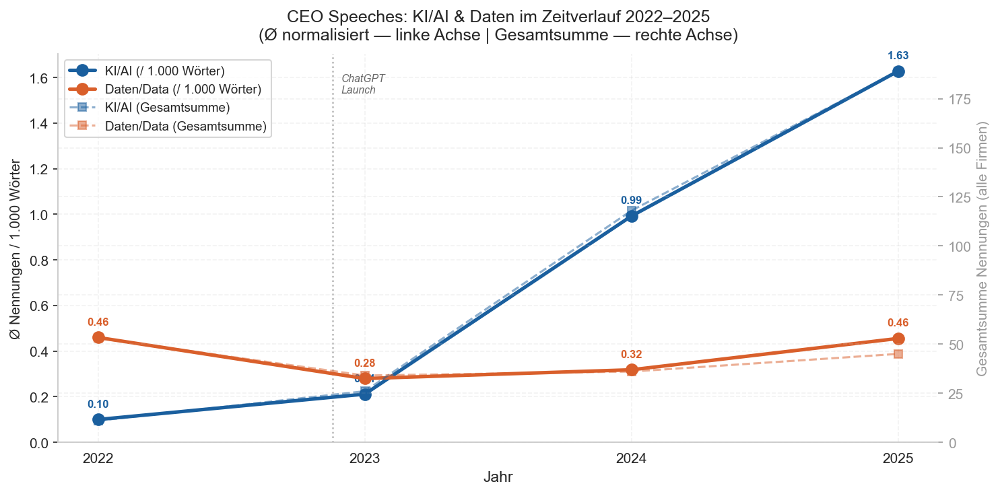
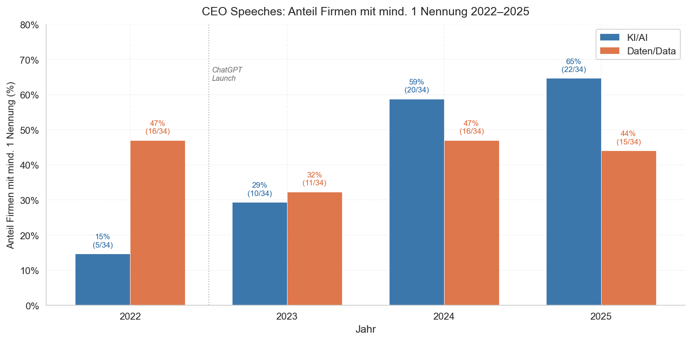
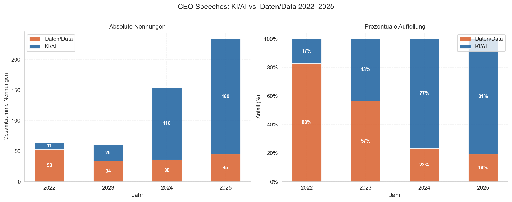
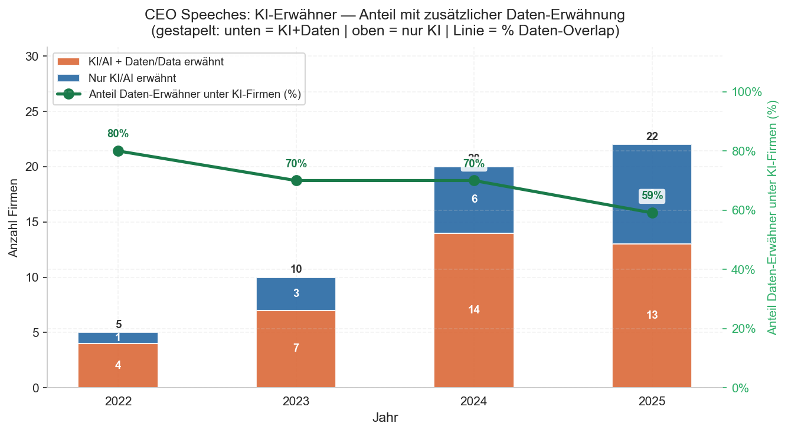
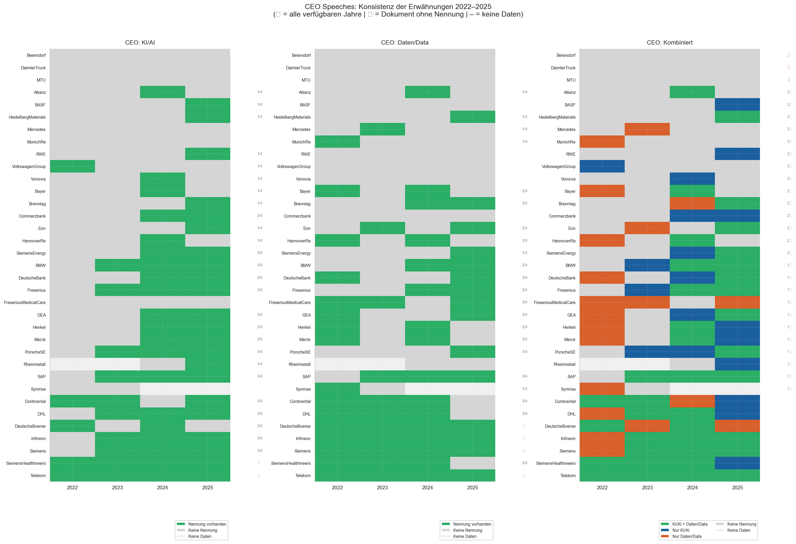
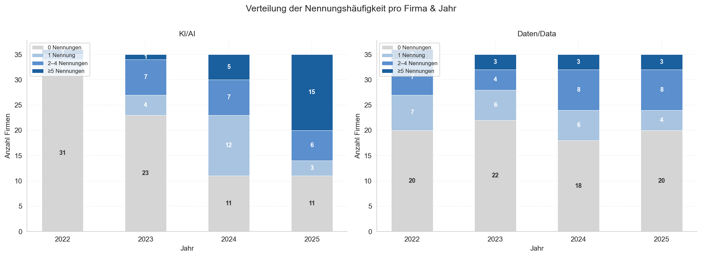

## Wie DAX-CEOs über KI sprechen — und was das über strategische Prioritäten verrät

*Analyse von 136 Hauptversammlungs-Reden (HV-Rede) der DAX-40-Unternehmen, 2022–2025*

---
### Das Wichtigste in 30 Sekunden

- **KI explodiert:** 2022 erwähnten 15% der DAX-CEOs KI in ihrer HV-Rede — 2025 sind es 65%. Die absoluten Nennungen von KI sind von 11 in 2022 auf 189 in 2025 gestiegen.
- **Daten stagnieren:** Die Erwähnung von Daten stagniert und verliert relativ sogar an Bedeutung.
- **Die Schere öffnet sich:** 2022 dominierten Daten-Begriffe noch die CEO-Reden (83% Nennungen von Daten, 17% von KI). 2025 macht KI 81% aus und kehrt das Verhältnis zu Daten um.

---

*Datenbasis + Analyse: 136 CEO-Reden aus 35 DAX-Unternehmen, 2022–2025. Systematische Analyse von Erwähnungen aus den Keyword-Gruppen KI (inkl. Künstliche Intelligenz, AI, Machine Learning, GenAI, LLM) und Daten (inkl. Daten, Data, data-driven). Vollständige Methodik am Ende des Dokuments.*

### Botschaft 1: Der ChatGPT-Effekt ist messbar

Die KI-Erwähnungen in CEO-Reden lagen 2022 noch bei 0,10 pro 1.000 Wörter und wurden nur von 15% der CEOs der Unternehmen erwähnt. Ende 2022 veränderte sich dann etwas grundlegend. Bis 2025 stieg dieser Wert auf 1,63 und auch die Anzahl von Reden mit Erwähnung von KI stieg auf 65%.

Die Entwicklung bei Stellungnahmen von Aufsichtsratsvorsitzenden spiegelt dabei einen ähnlichen Trend wieder, wenngleich auf mit durchweg niedrigeren absoluten Zahlen.

---

### Botschaft 2: Daten sind nicht verschwunden — aber verdrängt

2022 machten Daten-Begriffe 83% aller Nennungen in CEO-Reden aus. KI war eine Randnotiz. Drei Jahre später hat sich das Verhältnis umgekehrt: KI steht für 81% der Nennungen, Daten für 19%.

Das ist in absoluten Zahlen zwar fast eine Stagnation; Daten-Nennungen sinken leicht von 53 auf 45 Nennungen gesamt. Aber relativ zur KI-Rhetorik verliert das Thema Daten seinen Stellenwert in der öffentlichen Kommunikation.

---

### Botschaft 3: Wer KI sagt, sagt nicht unbedingt Daten

Von den CEOs die 2025 KI erwähnen, sprechen nur 59% auch über Daten — Tendenz fallend. 2022 lag dieser Wert noch bei 80%. Und: Nur 38% aller CEOs erwähnen 2025 in Ihren Reden die Keyword-Gruppen KI und Daten zusammen. Je mehr CEOs über KI sprechen, desto kleiner wird der Anteil der dabei auch die Datenbasis thematisiert. 

---

### Botschaft 4: Sechs Unternehmen — vier Jahre Schweigen

Die Konsistenz-Analyse zeigt: Sechs DAX-Unternehmen erwähnten KI in keiner einzigen CEO-Rede zwischen 2022 und 2025 (Beiersdorf, Daimler Truck, MTU, Mercedes, Munich Re, Fresenius Medical Care). Gleichzeitig gibt es eine wachsende Gruppe von Unternehmen, die das Thema seit dem KI-Shift 2022/2023 jedes Jahr adressieren (darunter SAP, Siemens, Infineon). Die Deutsche Telekom ist das einzige Unternehmen, das jedes Jahr KI und Daten zusammen erwähnt. Interessant: Alle aktuellen und ehemaligen Firmen des Siemens Konzerns (u.a. Siemens Energy, Siemens Healthineers, Infineon) erwähnen seit mindestens 2 Jahren konsequent KI in ihren CEO-Reden. 

---

### Was bedeutet das?
- Im Jahr 2025 erwähnt ein Drittel der CEOs von DAX-Unternehmen KI überhaupt nicht, und bei ~50 % fehlt die Erwähnung von Daten. Da KI in den kommenden Jahren einer der wichtigsten Werttreiber für Unternehmen und Aktionäre sein wird, wirft dieses Schweigen die Frage auf, wie zuversichtlich Unternehmen sind aus dieser Technologie eigene Wertsteigerung zu ziehen. Sechs Unternehmen gingen im Beobachtungszeitraum sogar in keiner einzigen ihrer Reden auf KI ein.
- Im Vergleich zu KI-Erwähnungen, nennen etwa 50 % weniger Unternehmen Daten, wobei das Verhältnis der Gesamtnennungen in den CEO-Reden bei 4:1 liegt. Zudem ging die Erwähnung von KI in Verbindung mit Daten von 80 % im Jahr 2022 auf 59 % im Jahr 2025 zurück. Ob dieses Schweigen operative Prioritäten widerspiegelt oder ob Datenstrategie intern kommuniziert wird — das bleibt offen. Genau das wollen wir in Interviews mit Verantwortlichen herausfinden.

---

### Fazit

**KI ist von einer Randnotiz zu einem zentralen Narrativ geworden**. 2022 erwähnten 15% der CEOs KI. 2025 sind es 65%. Aber: Daten gehen dabei unter. 2022 machten Daten-Begriffe noch 83% aller Nennungen der Keyword-Gruppen Daten und KI aus. 2025 sind es 19% und 81% für KI. Weiter: Von den CEOs die KI erwähnen, sprechen nur noch 59% auch über Daten — Tendenz fallend.

**Genau zu diesem Phänomen forsche ich deshalb**: Wie hat der KI-Shift die Auseinandersetzung mit Daten auf Organisationsebene verändert — und was passiert intern, das öffentlich nicht sichtbar ist, um Datenverfügbarkeit für KI zu steigern?

**Ich suche Interviews mit Daten- und KI-Experten aus Unternehmen**, um diese Entwicklung besser zu verstehen. Das Interview dauert 45 Minuten und ist Teil meiner Masterarbeit an der Universität Mannheim. Teilnehmende erhalten die vollständigen Analyseergebnisse  sowie eine Zusammenfassung der Interviewstudie nach Abschluss. Bei Interesse bin ich unter tgumpp@mail.uni-mannheim.de erreichbar.

---
### Anhang: Weitere Auswertungen

**Verteilung der Nennungshäufigkeit pro Firma & Jahr**

**Konsistenz der Erwähnungen 2022–2025 (CEO)**

---

### Methodische Anmerkungen

Analysiert wurden Reden von CEOs und der DAX-40-Unternehmen von 2022 - 2025 (DAX Zugehörigkeit Stand März 2026). Dafür wurden Transkripte der Reden eingelesen, sodass die Datenbasis insgesamt 136 Reden von 35 Unternehmen umfasst. Folgende Ausnahmen liegen vor:

- Keine Daten: Airbus, Qiagen
- Kein Transkript verfügbar: Scout24, Zalando, Adidas
- Unvollständige Daten: Symrise (nur 2022, 2023), Rheinmetall (nur 2024, 2025)
 
In der Datenbasis analysieren wir systematisch Erwähnungen aus den Keyword-Gruppen *KI* (inkl. *Künstliche Intelligenz*, *Machine Learning*, *GenAI*, *LLM*) und *Daten* (inkl. *Daten, datengetrieben, data-driven*), normalisiert auf 1.000 Wörter je Dokument und unabhängig der Sprache der Rede (deutsch oder englisch).

Die Hauptversammlungen finden zwischen Februar und Juni des jeweiligen Jahres statt. Außerordentliche Hauptversammlungen sind nicht inkludiert.

Zusätzlich analysieren wir Reden bzw. Berichte der Aufsichtsratsvorsitzenden. Die dortige Konsistenz und Vollständigkeit der Daten ist wesentlich geringer, wodurch wir mangels Vergleichbarkeit keine ausführlichen Analysen auf diesen Daten zur Verfügung stellen.

**Eignung der Daten**
*Vergleichbarkeit der Formate*: Das Format einer CEO-Rede bei der Hauptversammlung ist für börsennotierte Firmen über Firmengröße, Geschäftsmodell und Branche hinweg vergleichbar und eignet sich folglich gut für größere statistische Auswertungen.

*Bedeutung der Hauptversammlung:* Die Reden auf der Hauptversammlung sind Teil der öffentlichen Kommunikation und decken nicht die umfassenden Bemühungen von Unternehmen zur Verfolgung Ihrer Strategie ab. Dennoch geben sie die Richtung des Unternehmens vor und skizzieren die großen Linien seiner Ausrichtung. Zudem sind diese Reden stets an Investoren gerichtet, die aktuelle Markt- und Technologieentwicklungen und deren Implikationen für Unternehmen betrachten, um deren Potential für Wertsteigerungen zu beurteilen (z.B. durch Kosteneinsparungen oder Umsatzsteigerungen). Systematische Analysen zur Häufigkeit dieser Begriffe in öffentlicher Kommunikation geben Aufschluss darüber, wie zuversichtlich Unternehmen sind, aus KI und Daten eigene Wertsteigerungen zu ziehen.

**Reproduzierbarkeit**
Die Analyse ist vollständig reproduzierbar; Code und Methodik sind dokumentiert und stehen auf [GitHub](https://github.com/timtheuz/dax40-analysis) bereit.